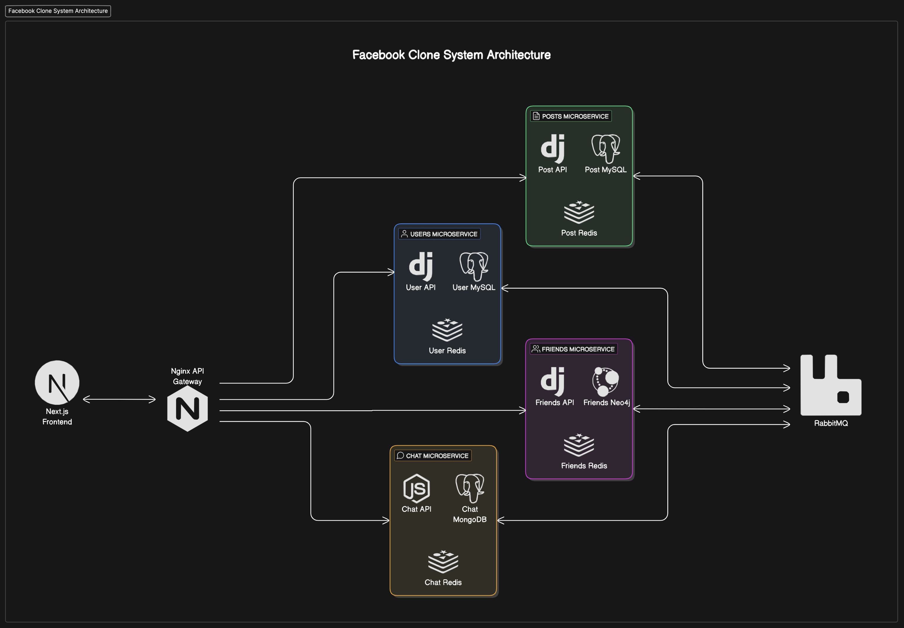

# **Facebook-Clone Project**

## Overview

This Facebook Clone project is a fully functional social media platform built with a microservices architecture. It features user authentication, posts, comments, likes, chat functionality, friend connections, and a modern frontend interface. The project emphasizes scalability, data consistency, and performance.

---

#### **High-Level Architecture**

1. **Microservices**

-   For detailed documentation of each microservice, please refer to the following:

    1. [Users Microservice](./user/README.md)
    2. [Posts Microservice](./posts/README.md)
    3. [Friends Microservice](./friends/README.md)
    4. [Chat Microservice](./chat/README.md)
    5. [Frontend Service](./frontend/README.md)

2. **Frontend**

    - Built with **Next.js**, the frontend offers a seamless user experience with modern UI/UX principles and server-side rendering.

3. **Databases**

    - **PostgreSQL**: Used for structured data in the Chat, Posts, and Users microservices.
    - **Neo4j**: Used in the Friends microservice to handle graph-based relationships like friendships and friend suggestions.

4. **Messaging and Caching**

    - **RabbitMQ**: Ensures data consistency across microservices by facilitating event-driven communication.
    - **Redis**:
        - Used for caching frequently accessed data.
        - Functions as the event store for channels in the Chat microservice to support real-time communication.

5. **Containerization**
    - All microservices and the frontend are fully containerized using Docker.
    - A **Docker Compose** file orchestrates the services, ensuring seamless development and deployment.

---

#### **Folder Structure**

```plaintext
facebook-clone/
│
├── users/              # Users Microservice
├── posts/              # Posts Microservice
├── friends/            # Friends Microservice
├── chat/               # Chat Microservice
├── frontend/           # Frontend Service
├── docker-compose.yml  # Docker Compose configuration
├── README.md           # Main Project Documentation
```

#### **Key Features**

-   **Authentication and Authorization**:

    -   User registration, login, and session management via the Users microservice.

-   **Posts Management**:

    -   Users can create, edit, delete, and view posts.
    -   Features like commenting and liking posts are supported.

-   **Friendship Management**:

    -   Users can send and accept friend requests.
    -   Friend suggestions are generated using graph-based algorithms in Neo4j.

-   **Real-time Chat**:

    -   Secure, scalable real-time messaging using Django Channels and Redis.

-   **Modern Frontend**:

    -   Built with Next.js for optimized performance and modern design.

-   **Scalability and Consistency**:

    -   Event-driven communication ensures data consistency across microservices using RabbitMQ.
    -   Redis caching improves response times for high-demand endpoints.

-   **Containerization**:
    -   All components are containerized for consistent deployment across different environments.

---

### **System Architecture**



#### **Technologies Used**

-   **Backend Framework**: Django with Django Rest Framework
-   **Frontend Framework**: Next.js
-   **Databases**: PostgreSQL, Neo4j
-   **Message Broker**: RabbitMQ
-   **Cache**: Redis
-   **Containerization**: Docker
-   **Orchestration**: Docker Compose

---

#### **Advantages of the Architecture**

1. **Scalability**: Each microservice can be scaled independently to handle growing user demands.
2. **Modularity**: Clear separation of concerns between different services simplifies maintenance and development.
3. **Data Consistency**: RabbitMQ ensures event-driven synchronization between services.
4. **Performance**: Redis caching improves the speed of frequently accessed data.
5. **Modern Development Practices**: The use of Docker and Docker Compose enables seamless deployment and development.

## Getting Started

### 1. Clone the repository

```bash
git clone https://github.com/apexkv/facebook-clone.git
cd facebook-clone
```

### 2. Configure environment variables for each service

-   These environment variables configure the necessary services like the database, message broker (RabbitMQ), and other service dependencies. Please make sure to fill in the appropriate values based on your environment.

#### Users .env

```plaintext
# ./users/.env

SECRET_KEY=ILKQ1giDu=

POSTGRES_DB=
POSTGRES_USER=
POSTGRES_PASSWORD=
POSTGRES_HOST=
POSTGRES_ROOT_PASSWORD=
POSTGRES_PORT=

RABBITMQ_DEFAULT_USER=
RABBITMQ_DEFAULT_PASS=
RABBITMQ_HOST=

CURRENT_QUEUE=users
QUEUE_LIST=friends,posts,chat
```

#### Chat .env

```plaintext
# ./chat/.env

# this secrete key need to be same screte key in Users service secrete key
SECRET_KEY=ILKQ1giDu=

POSTGRES_DB=
POSTGRES_USER=
POSTGRES_PASSWORD=
POSTGRES_HOST=
POSTGRES_ROOT_PASSWORD=
POSTGRES_PORT=

RABBITMQ_DEFAULT_USER=
RABBITMQ_DEFAULT_PASS=
RABBITMQ_HOST=

CURRENT_QUEUE=chat
QUEUE_LIST=friends,posts,users

USERS_SERVICE=http://users:8000
```

#### Posts .env

```plaintext
# ./posts/.env

SECRET_KEY=ILKQ1giDu=

POSTGRES_DB=
POSTGRES_USER=
POSTGRES_PASSWORD=
POSTGRES_HOST=
POSTGRES_ROOT_PASSWORD=
POSTGRES_PORT=

RABBITMQ_DEFAULT_USER=
RABBITMQ_DEFAULT_PASS=
RABBITMQ_HOST=

CURRENT_QUEUE=posts
QUEUE_LIST=friends,chats,users

USERS_SERVICE=http://users:8000
```

#### Friends .env

```plaintext
# ./friends/.env

SECRET_KEY=ILKQ1giDu=

NEO4J_AUTH=
NEO4j_HOST=

RABBITMQ_DEFAULT_USER=
RABBITMQ_DEFAULT_PASS=
RABBITMQ_HOST=

QUEUE_LIST=chat,posts,users
CURRENT_QUEUE=friends

USERS_SERVICE=http://users:8000
```

### 3. Start Service Using Docker

```bash
docker compose up --build
```

### 4. Now you can explorer the project in these endpoints

```
http://localhost:3000/ # nextjs frontend

http://localhost:888/api/users/ # users microservice

http://localhost:888/api/posts/ # posts microservice

http://localhost:888/api/friends/ # friends microservice

http://localhost:888/api/chat/ # chat microservice
```

---

### References

For more information on Docker and Docker Compose, visit their official documentation:

-   [Docker](https://docs.docker.com/)
-   [Docker Compose](https://docs.docker.com/compose/)
