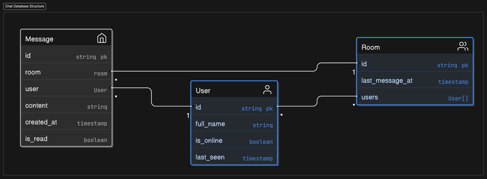

# **Chat Microservice**

## Table of Contents

## Overview

The Chat microservice handles real-time messaging functionality for the application. It allows users to send and receive messages within chat rooms and provides features such as unread message notifications and message delivery status. The microservice integrates with the Users microservice for user authentication and profile data, and uses RabbitMQ for efficient message propagation.

## Features

-   Real-time messaging
-   Unread message notifications
-   Message delivery status
-   Integration with Users microservice for authentication and profile data
-   Efficient message propagation using RabbitMQ
-   WebSocket support for real-time updates
-   Typing indicators
-   Friend status updates
-   Message read receipts
-   Pagination support for chat messages
-   Filtering users by online status
-   Secure communication with JWT authentication
-   RESTful API for chat operations

## Used Technologies

-   Django
-   Django Restframework
-   Channels
-   Postgresql
-   RabbitMQ
-   Redis

## Environment Variables

```plaintext
# need to use exact key as users microservice secret key for validate jwt
SECRET_KEY=

POSTGRES_DB=
POSTGRES_USER=
POSTGRES_PASSWORD=
POSTGRES_HOST=
POSTGRES_ROOT_PASSWORD=
POSTGRES_PORT=

RABBITMQ_DEFAULT_USER=
RABBITMQ_DEFAULT_PASS=
RABBITMQ_HOST=

CURRENT_QUEUE=chat
QUEUE_LIST=friends,posts,users

USERS_SERVICE=http://users:8000
```

## API Documentation

# Authentication

-   HTTP Authentication, scheme: basic

<h1 id="fb-clone-chat-api-chat">chat</h1>

## chat_users_list

<a id="opIdchat_users_list"></a>

> Code samples

```http
GET /api/chat/users/ HTTP/1.1

Accept: application/json

```

`GET /chat/users/`

Retrieve a list of chat rooms for the authenticated user.

<h3 id="chat_users_list-parameters">Parameters</h3>

| Name   | In    | Type    | Required | Description                                          |
| ------ | ----- | ------- | -------- | ---------------------------------------------------- |
| page   | query | integer | false    | A page number within the paginated result set.       |
| filter | query | string  | false    | Filter users. Use 'online' to get only online users. |

#### Enumerated Values

| Parameter | Value  |
| --------- | ------ |
| filter    | online |

> Example responses

> 200 Response

```json
{
    "count": 0,
    "next": "string",
    "previous": "string",
    "results": [
        {
            "id": "497f6eca-6276-4993-bfeb-53cbbbba6f08",
            "friend": "string",
            "last_message_at": "2019-08-24T14:15:22Z",
            "unread_count": 0,
            "last_message": "string"
        }
    ]
}
```

<h3 id="chat_users_list-responses">Responses</h3>

| Status | Meaning                                                         | Description  | Schema                              |
| ------ | --------------------------------------------------------------- | ------------ | ----------------------------------- |
| 200    | [OK](https://tools.ietf.org/html/rfc7231#section-6.3.1)         | none         | [ChatUserList](#schemachatuserlist) |
| 401    | [Unauthorized](https://tools.ietf.org/html/rfc7235#section-3.1) | Unauthorized | None                                |
| 404    | [Not Found](https://tools.ietf.org/html/rfc7231#section-6.5.4)  | Not Found    | None                                |

<aside class="warning">
To perform this operation, you must be authenticated by means of one of the following methods:
Basic
</aside>

## chat_users_read

<a id="opIdchat_users_read"></a>

> Code samples

```http
GET /api/chat/users/{id}/ HTTP/1.1

Accept: application/json

```

`GET /chat/users/{id}/`

Retrieve a single chat room for the authenticated user.

<h3 id="chat_users_read-parameters">Parameters</h3>

| Name | In   | Type   | Required | Description |
| ---- | ---- | ------ | -------- | ----------- |
| id   | path | string | true     | none        |

> Example responses

> 200 Response

```json
{
    "id": "497f6eca-6276-4993-bfeb-53cbbbba6f08",
    "friend": "string",
    "last_message_at": "2019-08-24T14:15:22Z",
    "unread_count": 0,
    "last_message": "string"
}
```

<h3 id="chat_users_read-responses">Responses</h3>

| Status | Meaning                                                         | Description  | Schema              |
| ------ | --------------------------------------------------------------- | ------------ | ------------------- |
| 200    | [OK](https://tools.ietf.org/html/rfc7231#section-6.3.1)         | none         | [Room](#schemaroom) |
| 401    | [Unauthorized](https://tools.ietf.org/html/rfc7235#section-3.1) | Unauthorized | None                |
| 404    | [Not Found](https://tools.ietf.org/html/rfc7231#section-6.5.4)  | Not Found    | None                |

<aside class="warning">
To perform this operation, you must be authenticated by means of one of the following methods:
None
</aside>

## chat_messages_list

<a id="opIdchat_messages_list"></a>

> Code samples

```http
GET /api/chat/{id}/messages/ HTTP/1.1

Accept: application/json

```

`GET /chat/{id}/messages/`

Retrieve a list of messages for the authenticated user.

<h3 id="chat_messages_list-parameters">Parameters</h3>

| Name | In    | Type    | Required | Description                                    |
| ---- | ----- | ------- | -------- | ---------------------------------------------- |
| page | query | integer | false    | A page number within the paginated result set. |
| id   | path  | string  | true     | none                                           |

> Example responses

> 200 Response

```json
{
    "count": 0,
    "next": "string",
    "previous": "string",
    "results": [
        {
            "id": "497f6eca-6276-4993-bfeb-53cbbbba6f08",
            "user": {
                "id": "497f6eca-6276-4993-bfeb-53cbbbba6f08",
                "full_name": "string",
                "is_online": true,
                "last_seen": "2019-08-24T14:15:22Z",
                "bg_color": "string"
            },
            "content": "string",
            "created_at": "2019-08-24T14:15:22Z",
            "direction": "string",
            "is_read": true,
            "room": "string"
        }
    ]
}
```

<h3 id="chat_messages_list-responses">Responses</h3>

| Status | Meaning                                                         | Description  | Schema                                    |
| ------ | --------------------------------------------------------------- | ------------ | ----------------------------------------- |
| 200    | [OK](https://tools.ietf.org/html/rfc7231#section-6.3.1)         | none         | [ChatMessageList](#schemachatmessagelist) |
| 401    | [Unauthorized](https://tools.ietf.org/html/rfc7235#section-3.1) | Unauthorized | None                                      |
| 404    | [Not Found](https://tools.ietf.org/html/rfc7231#section-6.5.4)  | Not Found    | None                                      |

<aside class="warning">
To perform this operation, you must be authenticated by means of one of the following methods:
Basic
</aside>

## chat_messages_create

<a id="opIdchat_messages_create"></a>

> Code samples

```http
POST /api/chat/{id}/messages/ HTTP/1.1

Content-Type: application/json

```

`POST /chat/{id}/messages/`

Mark all messages as read for the authenticated user.

> Body parameter

```json
{
    "user": {
        "full_name": "string",
        "is_online": true,
        "last_seen": "2019-08-24T14:15:22Z"
    },
    "content": "string",
    "is_read": true,
    "room": "string"
}
```

<h3 id="chat_messages_create-parameters">Parameters</h3>

| Name | In   | Type                      | Required | Description |
| ---- | ---- | ------------------------- | -------- | ----------- |
| body | body | [Message](#schemamessage) | true     | none        |
| id   | path | string                    | true     | none        |

<h3 id="chat_messages_create-responses">Responses</h3>

| Status | Meaning                                                         | Description  | Schema |
| ------ | --------------------------------------------------------------- | ------------ | ------ |
| 200    | [OK](https://tools.ietf.org/html/rfc7231#section-6.3.1)         | OK           | None   |
| 401    | [Unauthorized](https://tools.ietf.org/html/rfc7235#section-3.1) | Unauthorized | None   |
| 404    | [Not Found](https://tools.ietf.org/html/rfc7231#section-6.5.4)  | Not Found    | None   |

<aside class="warning">
To perform this operation, you must be authenticated by means of one of the following methods:
Basic
</aside>

Here’s a documentation template for your WebSocket endpoint, adhering to the format provided:

---

## Websocket Authentication

-   **WebSocket Authentication**: Query parameter `token` with a valid JWT Access Token.

## WebSocket Chat Endpoint

### Websocket Overview

This WebSocket endpoint allows real-time interaction for chat functionality. Clients can send and receive messages, typing indicators, and friend status updates.

**URL**:  
`ws://localhost:888/api/chat/ws/chat/?token=JWT_AUTH_ACCESS_TOKEN`

> Code samples

```javascript
const socket = new WebSocket("ws://localhost:888/api/chat/ws/chat/?token=YOUR_JWT_ACCESS_TOKEN");

socket.onmessage = (event) => {
    console.log(JSON.parse(event.data));
};

socket.send(
    JSON.stringify({
        type: "chat.message",
        data: {
            room: "ROOM_UUID",
            content: "Hello, how are you?",
        },
    })
);
```

<h3 id="websocket_chat-message-format">Message Format</h3>

| Name | Type        | Description                                     |
| ---- | ----------- | ----------------------------------------------- |
| type | string      | Event type (see Event Types below).             |
| data | JSON object | Event-specific payload (schema varies by type). |

### Event Types

#### `friend.online` / `friend.offline`

-   **Object (Server -> Client)**: `RoomSerializer`
-   **Description**: Notifies the user when a friend becomes online or offline.

```json
{
    "type": "friend.online",
    "data": {
        "id": "ROOM_UUID",
        "friend": {
            "id": "USER_UUID",
            "full_name": "John Doe",
            "is_online": true,
            "last_seen": "2023-09-01T12:00:00Z",
            "bg_color": "#c1a29e"
        },
        "last_message_at": "2023-09-01T12:10:00Z",
        "unread_count": 0,
        "last_message": "Hello!"
    }
}
```

#### `chat.message`

-   **Object (Client -> Server)**:
    ```json
    {
        "type": "chat.message",
        "data": {
            "room": "ROOM_UUID",
            "content": "Hello, how are you?"
        }
    }
    ```
-   **Object (Server -> Client)**: `MessageSerializer`

```json
{
    "type": "chat.message",
    "data": {
        "id": "MESSAGE_UUID",
        "user": {
            "id": "USER_UUID",
            "full_name": "Alice",
            "is_online": true,
            "last_seen": null,
            "bg_color": "#34a1cd"
        },
        "content": "Hello, how are you?",
        "created_at": "2023-09-01T12:15:00Z",
        "direction": "received",
        "is_read": false,
        "room": "ROOM_UUID"
    }
}
```

#### `friend.typing.start` / `friend.typing.stop`

-   **Object (Client -> Server)**:
    ```json
    {
        "type": "friend.typing.start",
        "data": {
            "room": "ROOM_UUID"
        }
    }
    ```
-   **Object (Server -> Client)**:
    ```json
    {
        "type": "friend.typing.start",
        "data": {
            "room": "ROOM_UUID",
            "user": "USER_UUID"
        }
    }
    ```

#### `chat.read`

-   **Object (Client -> Server)**:
    ```json
    {
        "type": "chat.read",
        "data": {
            "room": "ROOM_UUID"
        }
    }
    ```
-   **Object (Server -> Client)**:
    ```json
    {
        "type": "chat.read",
        "data": {
            "room": "ROOM_UUID",
            "user": "USER_UUID"
        }
    }
    ```

<h3 id="websocket_chat-responses">Responses</h3>

| Status | Meaning                                                                    | Description                           |
| ------ | -------------------------------------------------------------------------- | ------------------------------------- |
| 101    | [Switching Protocols](https://datatracker.ietf.org/doc/html/rfc6455)       | Connection upgrade to WebSocket       |
| 400    | [Bad Request](https://datatracker.ietf.org/doc/html/rfc7231#section-6.5.1) | Invalid WebSocket connection request. |
| 401    | [Unauthorized](https://datatracker.ietf.org/doc/html/rfc7235#section-3.1)  | Invalid or missing authentication.    |

<aside class="warning">
To perform this operation, you must connect using a valid JWT Access Token.
</aside>

# Schemas

<h2 id="tocS_Room">Room</h2>
<!-- backwards compatibility -->
<a id="schemaroom"></a>
<a id="schema_Room"></a>
<a id="tocSroom"></a>
<a id="tocsroom"></a>

```json
{
    "id": "497f6eca-6276-4993-bfeb-53cbbbba6f08",
    "friend": "string",
    "last_message_at": "2019-08-24T14:15:22Z",
    "unread_count": 0,
    "last_message": "string"
}
```

### Properties

| Name            | Type                   | Required | Restrictions | Description |
| --------------- | ---------------------- | -------- | ------------ | ----------- |
| id              | string(uuid)           | false    | read-only    | none        |
| friend          | string                 | false    | read-only    | none        |
| last_message_at | string(date-time)¦null | false    | none         | none        |
| unread_count    | integer                | true     | none         | none        |
| last_message    | string                 | true     | none         | none        |

<h2 id="tocS_ChatUserList">ChatUserList</h2>
<!-- backwards compatibility -->
<a id="schemachatuserlist"></a>
<a id="schema_ChatUserList"></a>
<a id="tocSchatuserlist"></a>
<a id="tocschatuserlist"></a>

```json
{
    "count": 0,
    "next": "string",
    "previous": "string",
    "results": [
        {
            "id": "497f6eca-6276-4993-bfeb-53cbbbba6f08",
            "friend": "string",
            "last_message_at": "2019-08-24T14:15:22Z",
            "unread_count": 0,
            "last_message": "string"
        }
    ]
}
```

### Properties

| Name     | Type                  | Required | Restrictions | Description |
| -------- | --------------------- | -------- | ------------ | ----------- |
| count    | integer               | true     | none         | none        |
| next     | string¦null           | true     | none         | none        |
| previous | string¦null           | true     | none         | none        |
| results  | [[Room](#schemaroom)] | true     | none         | none        |

<h2 id="tocS_User">User</h2>
<!-- backwards compatibility -->
<a id="schemauser"></a>
<a id="schema_User"></a>
<a id="tocSuser"></a>
<a id="tocsuser"></a>

```json
{
    "id": "497f6eca-6276-4993-bfeb-53cbbbba6f08",
    "full_name": "string",
    "is_online": true,
    "last_seen": "2019-08-24T14:15:22Z",
    "bg_color": "string"
}
```

### Properties

| Name      | Type                   | Required | Restrictions | Description |
| --------- | ---------------------- | -------- | ------------ | ----------- |
| id        | string(uuid)           | false    | read-only    | none        |
| full_name | string                 | true     | none         | none        |
| is_online | boolean                | false    | none         | none        |
| last_seen | string(date-time)¦null | false    | none         | none        |
| bg_color  | string                 | false    | read-only    | none        |

<h2 id="tocS_Message">Message</h2>
<!-- backwards compatibility -->
<a id="schemamessage"></a>
<a id="schema_Message"></a>
<a id="tocSmessage"></a>
<a id="tocsmessage"></a>

```json
{
    "id": "497f6eca-6276-4993-bfeb-53cbbbba6f08",
    "user": {
        "id": "497f6eca-6276-4993-bfeb-53cbbbba6f08",
        "full_name": "string",
        "is_online": true,
        "last_seen": "2019-08-24T14:15:22Z",
        "bg_color": "string"
    },
    "content": "string",
    "created_at": "2019-08-24T14:15:22Z",
    "direction": "string",
    "is_read": true,
    "room": "string"
}
```

### Properties

| Name       | Type                | Required | Restrictions | Description |
| ---------- | ------------------- | -------- | ------------ | ----------- |
| id         | string(uuid)        | false    | read-only    | none        |
| user       | [User](#schemauser) | true     | none         | none        |
| content    | string              | true     | none         | none        |
| created_at | string(date-time)   | false    | read-only    | none        |
| direction  | string              | false    | read-only    | none        |
| is_read    | boolean             | false    | none         | none        |
| room       | string              | true     | none         | none        |

<h2 id="tocS_ChatMessageList">ChatMessageList</h2>
<!-- backwards compatibility -->
<a id="schemachatmessagelist"></a>
<a id="schema_ChatMessageList"></a>
<a id="tocSchatmessagelist"></a>
<a id="tocschatmessagelist"></a>

```json
{
    "count": 0,
    "next": "string",
    "previous": "string",
    "results": [
        {
            "id": "497f6eca-6276-4993-bfeb-53cbbbba6f08",
            "user": {
                "id": "497f6eca-6276-4993-bfeb-53cbbbba6f08",
                "full_name": "string",
                "is_online": true,
                "last_seen": "2019-08-24T14:15:22Z",
                "bg_color": "string"
            },
            "content": "string",
            "created_at": "2019-08-24T14:15:22Z",
            "direction": "string",
            "is_read": true,
            "room": "string"
        }
    ]
}
```

### Properties

| Name     | Type                        | Required | Restrictions | Description |
| -------- | --------------------------- | -------- | ------------ | ----------- |
| count    | integer                     | true     | none         | none        |
| next     | string¦null                 | true     | none         | none        |
| previous | string¦null                 | true     | none         | none        |
| results  | [[Message](#schemamessage)] | true     | none         | none        |

## Database Architecture



## License

This project is licensed under the MIT License. See the [LICENSE](./LICENSE) file for details.
