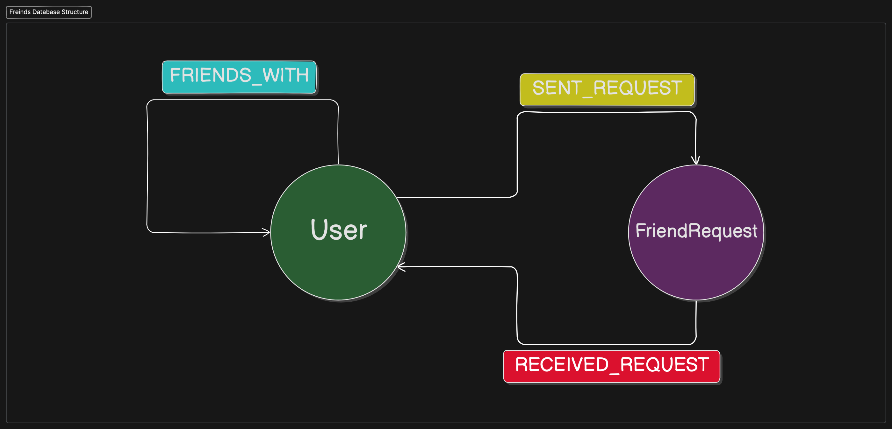

# **Friends Microservice**

## Table of Contents

## Overview

The Friends microservice manages friendships and friend requests between users. It provides APIs for sending, accepting, and rejecting friend requests, as well as retrieving friend lists and mutual friends. This service integrates with the Users microservice to fetch user details and with the Posts microservice to provide friend-related content recommendations.

## Features

-   Sending friend requests
-   Accepting friend requests
-   Rejecting friend requests
-   Retrieving friend lists
-   Retrieving mutual friends
-   Friend suggestions
-   Integration with Users microservice for user details
-   Integration with Posts microservice for content recommendations
-   Efficient message propagation using RabbitMQ
-   Secure communication with JWT authentication
-   RESTful API for friend operations

## Used Technologies

-   Django
-   Django Restframework
-   Neo4j
-   RabbitMQ
-   Redis

## Environment Variables

```plaintext
SECRET_KEY=

NEO4J_AUTH=
NEO4j_HOST=

USERS_SERVICE=http://users:8000

RABBITMQ_DEFAULT_USER=
RABBITMQ_DEFAULT_PASS=
RABBITMQ_HOST=

QUEUE_LIST=friends,posts,users
CURRENT_QUEUE=friends
```

## API Documentation

# Authentication

-   HTTP Authentication, scheme: basic

<h1 id="fb-clone-friends-api-me">me</h1>

## Get user request count

<a id="opIdme_list"></a>

> Code samples

```http
GET /api/friends/me/ HTTP/1.1

Accept: application/json

```

`GET /me/`

Get the number of friend requests received by the user

> Example responses

> 200 Response

```json
{
    "request_count": 0
}
```

<h3 id="get-user-request-count-responses">Responses</h3>

| Status | Meaning                                                         | Description  | Schema                                      |
| ------ | --------------------------------------------------------------- | ------------ | ------------------------------------------- |
| 200    | [OK](https://tools.ietf.org/html/rfc7231#section-6.3.1)         | none         | [UserRequestCount](#schemauserrequestcount) |
| 401    | [Unauthorized](https://tools.ietf.org/html/rfc7235#section-3.1) | Unauthorized | None                                        |

<aside class="warning">
To perform this operation, you must be authenticated by means of one of the following methods:
Basic
</aside>

<h1 id="fb-clone-friends-api-suggestions">suggestions</h1>

## Get friend suggestions

<a id="opIdsuggestions_read"></a>

> Code samples

```http
GET /api/friends/suggestions/{id}/ HTTP/1.1

Accept: application/json

```

`GET /suggestions/{id}/`

Get the friend suggestions for the user

<h3 id="get-friend-suggestions-parameters">Parameters</h3>

| Name | In   | Type   | Required | Description |
| ---- | ---- | ------ | -------- | ----------- |
| id   | path | string | true     | none        |

> Example responses

> 200 Response

```json
{
    "next": "http://example.com",
    "results": [
        {
            "id": "497f6eca-6276-4993-bfeb-53cbbbba6f08",
            "full_name": "string",
            "mutual_friends": 0,
            "mutual_friends_name_list": ["string"],
            "is_friend": true,
            "sent_request": true,
            "received_request": true
        }
    ]
}
```

<h3 id="get-friend-suggestions-responses">Responses</h3>

| Status | Meaning                                                         | Description  | Schema                      |
| ------ | --------------------------------------------------------------- | ------------ | --------------------------- |
| 200    | [OK](https://tools.ietf.org/html/rfc7231#section-6.3.1)         | none         | [UserList](#schemauserlist) |
| 401    | [Unauthorized](https://tools.ietf.org/html/rfc7235#section-3.1) | Unauthorized | None                        |

<aside class="warning">
To perform this operation, you must be authenticated by means of one of the following methods:
Basic
</aside>

## Delete friend suggestion

<a id="opIdsuggestions_delete"></a>

> Code samples

```http
DELETE /api/friends/suggestions/{id}/ HTTP/1.1

```

`DELETE /suggestions/{id}/`

Delete a friend suggestion

<h3 id="delete-friend-suggestion-parameters">Parameters</h3>

| Name | In   | Type   | Required | Description |
| ---- | ---- | ------ | -------- | ----------- |
| id   | path | string | true     | none        |

<h3 id="delete-friend-suggestion-responses">Responses</h3>

| Status | Meaning                                                         | Description    | Schema |
| ------ | --------------------------------------------------------------- | -------------- | ------ |
| 204    | [No Content](https://tools.ietf.org/html/rfc7231#section-6.3.5) | No Content     | None   |
| 401    | [Unauthorized](https://tools.ietf.org/html/rfc7235#section-3.1) | Unauthorized   | None   |
| 404    | [Not Found](https://tools.ietf.org/html/rfc7231#section-6.5.4)  | User not found | None   |

<aside class="warning">
To perform this operation, you must be authenticated by means of one of the following methods:
Basic
</aside>

<h1 id="fb-clone-friends-api-users">users</h1>

## Get friend requests

<a id="opIdusers_friends_requests_list"></a>

> Code samples

```http
GET /api/friends/users/friends/requests/ HTTP/1.1

Accept: application/json

```

`GET /users/friends/requests/`

Get the friend requests received by the user

> Example responses

> 200 Response

```json
{
    "next": "http://example.com",
    "results": [
        {
            "id": "497f6eca-6276-4993-bfeb-53cbbbba6f08",
            "req_id": "b0b81fb9-c6eb-4a11-855e-45e48af9566f",
            "full_name": "string",
            "created_at": "2019-08-24T14:15:22Z",
            "sent_request": true,
            "received_request": true,
            "mutual_friends": 0,
            "mutual_friends_name_list": ["string"]
        }
    ]
}
```

<h3 id="get-friend-requests-responses">Responses</h3>

| Status | Meaning                                                         | Description  | Schema                                        |
| ------ | --------------------------------------------------------------- | ------------ | --------------------------------------------- |
| 200    | [OK](https://tools.ietf.org/html/rfc7231#section-6.3.1)         | none         | [FriendRequestList](#schemafriendrequestlist) |
| 401    | [Unauthorized](https://tools.ietf.org/html/rfc7235#section-3.1) | Unauthorized | None                                          |

<aside class="warning">
To perform this operation, you must be authenticated by means of one of the following methods:
Basic
</aside>

## Send friend request

<a id="opIdusers_friends_requests_create"></a>

> Code samples

```http
POST /api/friends/users/friends/requests/ HTTP/1.1

Content-Type: application/json
Accept: application/json

```

`POST /users/friends/requests/`

Send a friend request to another user

> Body parameter

```json
{
    "user_to_id": "7380bf92-4931-437e-ac11-314f80255fbd"
}
```

<h3 id="send-friend-request-parameters">Parameters</h3>

| Name | In   | Type                                  | Required | Description |
| ---- | ---- | ------------------------------------- | -------- | ----------- |
| body | body | [FriendRequest](#schemafriendrequest) | true     | none        |

> Example responses

> 201 Response

```json
{
    "id": "497f6eca-6276-4993-bfeb-53cbbbba6f08",
    "req_id": "b0b81fb9-c6eb-4a11-855e-45e48af9566f",
    "full_name": "string",
    "created_at": "2019-08-24T14:15:22Z",
    "sent_request": true,
    "received_request": true,
    "mutual_friends": 0,
    "mutual_friends_name_list": ["string"]
}
```

<h3 id="send-friend-request-responses">Responses</h3>

| Status | Meaning                                                          | Description  | Schema                                            |
| ------ | ---------------------------------------------------------------- | ------------ | ------------------------------------------------- |
| 201    | [Created](https://tools.ietf.org/html/rfc7231#section-6.3.2)     | none         | [FriendRequestObject](#schemafriendrequestobject) |
| 400    | [Bad Request](https://tools.ietf.org/html/rfc7231#section-6.5.1) | Bad Request  | None                                              |
| 401    | [Unauthorized](https://tools.ietf.org/html/rfc7235#section-3.1)  | Unauthorized | None                                              |

<aside class="warning">
To perform this operation, you must be authenticated by means of one of the following methods:
Basic
</aside>

## Accept or reject friend request

<a id="opIdusers_friends_requests_action_create"></a>

> Code samples

```http
POST /api/friends/users/friends/requests/action/ HTTP/1.1

Content-Type: application/json

```

`POST /users/friends/requests/action/`

Accept or reject a friend request

> Body parameter

```json
{
    "action": "accept",
    "request_id": "266ea41d-adf5-480b-af50-15b940c2b846"
}
```

<h3 id="accept-or-reject-friend-request-parameters">Parameters</h3>

| Name | In   | Type                                              | Required | Description |
| ---- | ---- | ------------------------------------------------- | -------- | ----------- |
| body | body | [FriendRequestAction](#schemafriendrequestaction) | true     | none        |

<h3 id="accept-or-reject-friend-request-responses">Responses</h3>

| Status | Meaning                                                         | Description              | Schema |
| ------ | --------------------------------------------------------------- | ------------------------ | ------ |
| 204    | [No Content](https://tools.ietf.org/html/rfc7231#section-6.3.5) | No Content               | None   |
| 401    | [Unauthorized](https://tools.ietf.org/html/rfc7235#section-3.1) | Unauthorized             | None   |
| 404    | [Not Found](https://tools.ietf.org/html/rfc7231#section-6.5.4)  | Friend request not found | None   |

<aside class="warning">
To perform this operation, you must be authenticated by means of one of the following methods:
Basic
</aside>

## Get sent friend requests

<a id="opIdusers_friends_requests_sent_list"></a>

> Code samples

```http
GET /api/friends/users/friends/requests/sent/ HTTP/1.1

Accept: application/json

```

`GET /users/friends/requests/sent/`

Get the friend requests sent by the user

> Example responses

> 200 Response

```json
{
    "next": "http://example.com",
    "results": [
        {
            "id": "497f6eca-6276-4993-bfeb-53cbbbba6f08",
            "req_id": "b0b81fb9-c6eb-4a11-855e-45e48af9566f",
            "full_name": "string",
            "created_at": "2019-08-24T14:15:22Z",
            "sent_request": true,
            "received_request": true,
            "mutual_friends": 0,
            "mutual_friends_name_list": ["string"]
        }
    ]
}
```

<h3 id="get-sent-friend-requests-responses">Responses</h3>

| Status | Meaning                                                         | Description  | Schema                                        |
| ------ | --------------------------------------------------------------- | ------------ | --------------------------------------------- |
| 200    | [OK](https://tools.ietf.org/html/rfc7231#section-6.3.1)         | none         | [FriendRequestList](#schemafriendrequestlist) |
| 401    | [Unauthorized](https://tools.ietf.org/html/rfc7235#section-3.1) | Unauthorized | None                                          |

<aside class="warning">
To perform this operation, you must be authenticated by means of one of the following methods:
Basic
</aside>

## Get user details

<a id="opIdusers_read"></a>

> Code samples

```http
GET /api/friends/users/{id}/ HTTP/1.1

Accept: application/json

```

`GET /users/{id}/`

Get the user details by user id

<h3 id="get-user-details-parameters">Parameters</h3>

| Name | In   | Type   | Required | Description |
| ---- | ---- | ------ | -------- | ----------- |
| id   | path | string | true     | none        |

> Example responses

> 200 Response

```json
{
    "id": "497f6eca-6276-4993-bfeb-53cbbbba6f08",
    "full_name": "string",
    "is_friend": true,
    "sent_request": true,
    "received_request": true
}
```

<h3 id="get-user-details-responses">Responses</h3>

| Status | Meaning                                                         | Description    | Schema                              |
| ------ | --------------------------------------------------------------- | -------------- | ----------------------------------- |
| 200    | [OK](https://tools.ietf.org/html/rfc7231#section-6.3.1)         | none           | [UserRetrieve](#schemauserretrieve) |
| 401    | [Unauthorized](https://tools.ietf.org/html/rfc7235#section-3.1) | Unauthorized   | None                                |
| 404    | [Not Found](https://tools.ietf.org/html/rfc7231#section-6.5.4)  | User not found | None                                |

<aside class="warning">
To perform this operation, you must be authenticated by means of one of the following methods:
Basic
</aside>

## Get user friends

<a id="opIdusers_friends_list"></a>

> Code samples

```http
GET /api/friends/users/{id}/friends/ HTTP/1.1

Accept: application/json

```

`GET /users/{id}/friends/`

Get the user friends by user id

<h3 id="get-user-friends-parameters">Parameters</h3>

| Name | In    | Type    | Required | Description                                    |
| ---- | ----- | ------- | -------- | ---------------------------------------------- |
| page | query | integer | false    | A page number within the paginated result set. |
| id   | path  | string  | true     | none                                           |

> Example responses

> 200 Response

```json
{
    "next": "http://example.com",
    "results": [
        {
            "id": "497f6eca-6276-4993-bfeb-53cbbbba6f08",
            "full_name": "string",
            "mutual_friends": 0,
            "mutual_friends_name_list": ["string"],
            "is_friend": true,
            "sent_request": true,
            "received_request": true
        }
    ]
}
```

<h3 id="get-user-friends-responses">Responses</h3>

| Status | Meaning                                                         | Description    | Schema                      |
| ------ | --------------------------------------------------------------- | -------------- | --------------------------- |
| 200    | [OK](https://tools.ietf.org/html/rfc7231#section-6.3.1)         | none           | [UserList](#schemauserlist) |
| 401    | [Unauthorized](https://tools.ietf.org/html/rfc7235#section-3.1) | Unauthorized   | None                        |
| 404    | [Not Found](https://tools.ietf.org/html/rfc7231#section-6.5.4)  | User not found | None                        |

<aside class="warning">
To perform this operation, you must be authenticated by means of one of the following methods:
Basic
</aside>

## Get mutual friends

<a id="opIdusers_friends_mutual_list"></a>

> Code samples

```http
GET /api/friends/users/{id}/friends/mutual/ HTTP/1.1

Accept: application/json

```

`GET /users/{id}/friends/mutual/`

Get the mutual friends between two users

<h3 id="get-mutual-friends-parameters">Parameters</h3>

| Name | In    | Type    | Required | Description                                    |
| ---- | ----- | ------- | -------- | ---------------------------------------------- |
| page | query | integer | false    | A page number within the paginated result set. |
| id   | path  | string  | true     | none                                           |

> Example responses

> 200 Response

```json
{
    "next": "http://example.com",
    "results": [
        {
            "id": "497f6eca-6276-4993-bfeb-53cbbbba6f08",
            "full_name": "string",
            "mutual_friends": 0,
            "mutual_friends_name_list": ["string"],
            "is_friend": true,
            "sent_request": true,
            "received_request": true
        }
    ]
}
```

<h3 id="get-mutual-friends-responses">Responses</h3>

| Status | Meaning                                                         | Description    | Schema                      |
| ------ | --------------------------------------------------------------- | -------------- | --------------------------- |
| 200    | [OK](https://tools.ietf.org/html/rfc7231#section-6.3.1)         | none           | [UserList](#schemauserlist) |
| 401    | [Unauthorized](https://tools.ietf.org/html/rfc7235#section-3.1) | Unauthorized   | None                        |
| 404    | [Not Found](https://tools.ietf.org/html/rfc7231#section-6.5.4)  | User not found | None                        |

<aside class="warning">
To perform this operation, you must be authenticated by means of one of the following methods:
Basic
</aside>

# Schemas

<h2 id="tocS_UserRequestCount">UserRequestCount</h2>
<!-- backwards compatibility -->
<a id="schemauserrequestcount"></a>
<a id="schema_UserRequestCount"></a>
<a id="tocSuserrequestcount"></a>
<a id="tocsuserrequestcount"></a>

```json
{
    "request_count": 0
}
```

### Properties

| Name          | Type    | Required | Restrictions | Description |
| ------------- | ------- | -------- | ------------ | ----------- |
| request_count | integer | true     | none         | none        |

<h2 id="tocS_User">User</h2>
<!-- backwards compatibility -->
<a id="schemauser"></a>
<a id="schema_User"></a>
<a id="tocSuser"></a>
<a id="tocsuser"></a>

```json
{
    "id": "497f6eca-6276-4993-bfeb-53cbbbba6f08",
    "full_name": "string",
    "mutual_friends": 0,
    "mutual_friends_name_list": ["string"],
    "is_friend": true,
    "sent_request": true,
    "received_request": true
}
```

### Properties

| Name                     | Type         | Required | Restrictions | Description |
| ------------------------ | ------------ | -------- | ------------ | ----------- |
| id                       | string(uuid) | true     | none         | none        |
| full_name                | string       | true     | none         | none        |
| mutual_friends           | integer      | true     | none         | none        |
| mutual_friends_name_list | [string]     | true     | none         | none        |
| is_friend                | boolean      | true     | none         | none        |
| sent_request             | boolean      | true     | none         | none        |
| received_request         | boolean      | true     | none         | none        |

<h2 id="tocS_UserList">UserList</h2>
<!-- backwards compatibility -->
<a id="schemauserlist"></a>
<a id="schema_UserList"></a>
<a id="tocSuserlist"></a>
<a id="tocsuserlist"></a>

```json
{
    "next": "http://example.com",
    "results": [
        {
            "id": "497f6eca-6276-4993-bfeb-53cbbbba6f08",
            "full_name": "string",
            "mutual_friends": 0,
            "mutual_friends_name_list": ["string"],
            "is_friend": true,
            "sent_request": true,
            "received_request": true
        }
    ]
}
```

### Properties

| Name    | Type                  | Required | Restrictions | Description |
| ------- | --------------------- | -------- | ------------ | ----------- |
| next    | string(uri)           | true     | none         | none        |
| results | [[User](#schemauser)] | true     | none         | none        |

<h2 id="tocS_FriendRequestObject">FriendRequestObject</h2>
<!-- backwards compatibility -->
<a id="schemafriendrequestobject"></a>
<a id="schema_FriendRequestObject"></a>
<a id="tocSfriendrequestobject"></a>
<a id="tocsfriendrequestobject"></a>

```json
{
    "id": "497f6eca-6276-4993-bfeb-53cbbbba6f08",
    "req_id": "b0b81fb9-c6eb-4a11-855e-45e48af9566f",
    "full_name": "string",
    "created_at": "2019-08-24T14:15:22Z",
    "sent_request": true,
    "received_request": true,
    "mutual_friends": 0,
    "mutual_friends_name_list": ["string"]
}
```

### Properties

| Name                     | Type              | Required | Restrictions | Description |
| ------------------------ | ----------------- | -------- | ------------ | ----------- |
| id                       | string(uuid)      | true     | none         | none        |
| req_id                   | string(uuid)      | true     | none         | none        |
| full_name                | string            | true     | none         | none        |
| created_at               | string(date-time) | true     | none         | none        |
| sent_request             | boolean           | true     | none         | none        |
| received_request         | boolean           | true     | none         | none        |
| mutual_friends           | integer           | true     | none         | none        |
| mutual_friends_name_list | [string]          | true     | none         | none        |

<h2 id="tocS_FriendRequestList">FriendRequestList</h2>
<!-- backwards compatibility -->
<a id="schemafriendrequestlist"></a>
<a id="schema_FriendRequestList"></a>
<a id="tocSfriendrequestlist"></a>
<a id="tocsfriendrequestlist"></a>

```json
{
    "next": "http://example.com",
    "results": [
        {
            "id": "497f6eca-6276-4993-bfeb-53cbbbba6f08",
            "req_id": "b0b81fb9-c6eb-4a11-855e-45e48af9566f",
            "full_name": "string",
            "created_at": "2019-08-24T14:15:22Z",
            "sent_request": true,
            "received_request": true,
            "mutual_friends": 0,
            "mutual_friends_name_list": ["string"]
        }
    ]
}
```

### Properties

| Name    | Type                                                | Required | Restrictions | Description |
| ------- | --------------------------------------------------- | -------- | ------------ | ----------- |
| next    | string(uri)                                         | true     | none         | none        |
| results | [[FriendRequestObject](#schemafriendrequestobject)] | true     | none         | none        |

<h2 id="tocS_FriendRequest">FriendRequest</h2>
<!-- backwards compatibility -->
<a id="schemafriendrequest"></a>
<a id="schema_FriendRequest"></a>
<a id="tocSfriendrequest"></a>
<a id="tocsfriendrequest"></a>

```json
{
    "user_to_id": "7380bf92-4931-437e-ac11-314f80255fbd",
    "req_id": "string",
    "created_at": "2019-08-24T14:15:22Z",
    "mutual_friends_count": 0,
    "mutual_friends_name_list": ["string"]
}
```

### Properties

| Name                     | Type              | Required | Restrictions | Description |
| ------------------------ | ----------------- | -------- | ------------ | ----------- |
| user_to_id               | string(uuid)      | true     | none         | none        |
| req_id                   | string            | false    | read-only    | none        |
| created_at               | string(date-time) | false    | read-only    | none        |
| mutual_friends_count     | integer           | false    | read-only    | none        |
| mutual_friends_name_list | [string]          | false    | read-only    | none        |

<h2 id="tocS_FriendRequestAction">FriendRequestAction</h2>
<!-- backwards compatibility -->
<a id="schemafriendrequestaction"></a>
<a id="schema_FriendRequestAction"></a>
<a id="tocSfriendrequestaction"></a>
<a id="tocsfriendrequestaction"></a>

```json
{
    "action": "accept",
    "request_id": "266ea41d-adf5-480b-af50-15b940c2b846"
}
```

### Properties

| Name       | Type         | Required | Restrictions | Description |
| ---------- | ------------ | -------- | ------------ | ----------- |
| action     | string       | true     | none         | none        |
| request_id | string(uuid) | true     | none         | none        |

#### Enumerated Values

| Property | Value  |
| -------- | ------ |
| action   | accept |
| action   | reject |

<h2 id="tocS_UserRetrieve">UserRetrieve</h2>
<!-- backwards compatibility -->
<a id="schemauserretrieve"></a>
<a id="schema_UserRetrieve"></a>
<a id="tocSuserretrieve"></a>
<a id="tocsuserretrieve"></a>

```json
{
    "id": "497f6eca-6276-4993-bfeb-53cbbbba6f08",
    "full_name": "string",
    "is_friend": true,
    "sent_request": true,
    "received_request": true
}
```

### Properties

| Name             | Type         | Required | Restrictions | Description |
| ---------------- | ------------ | -------- | ------------ | ----------- |
| id               | string(uuid) | true     | none         | none        |
| full_name        | string       | true     | none         | none        |
| is_friend        | boolean      | true     | none         | none        |
| sent_request     | boolean      | true     | none         | none        |
| received_request | boolean      | true     | none         | none        |

## Database Architecture



## License

This project is licensed under the MIT License. See the [LICENSE](./LICENSE) file for details.
