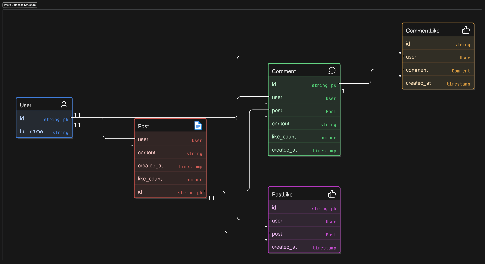

# **Posts Microservice**

## Table of Contents

## Overview

The Posts microservice manages user-generated content such as posts, comments, and likes. It provides APIs for creating, reading, updating, and deleting posts, as well as managing interactions like comments and likes. It integrates with the Users microservice for author information and with the Friends microservice to show content only from friends. Redis caching is used to optimize post retrieval performance.

## Features

-   Create, read, update, and delete posts
-   Comment on posts
-   Like and unlike posts and comments
-   View a feed of posts from friends
-   List posts by a specific user
-   List comments on a specific post
-   Redis caching for optimized post retrieval
-   Integration with Users microservice for author information
-   Integration with Friends microservice to filter posts
-   Basic HTTP authentication
-   Pagination support for listing endpoints

## Used Technologies

-   Django
-   Django Restframework
-   Postgresql
-   RabbitMQ
-   Redis

## Environment Variables

```plaintext
SECRET_KEY=
POSTGRES_DB=
POSTGRES_USER=
POSTGRES_PASSWORD=
POSTGRES_HOST=
POSTGRES_ROOT_PASSWORD=
POSTGRES_PORT=

USERS_SERVICE=http://users:8000

RABBITMQ_DEFAULT_USER=
RABBITMQ_DEFAULT_PASS=
RABBITMQ_HOST=

CURRENT_QUEUE=posts
QUEUE_LIST=friends,posts,users
```

## API Documentation

# Authentication

-   HTTP Authentication, scheme: basic

<h1 id="fb-clone-posts-api-posts">posts</h1>

## posts_create

<a id="opIdposts_create"></a>

> Code samples

```http
POST /api/posts/ HTTP/1.1

Content-Type: application/json
Accept: application/json

```

`POST /posts/`

Create a post

> Body parameter

```json
{
    "content": "string"
}
```

<h3 id="posts_create-parameters">Parameters</h3>

| Name | In   | Type                        | Required | Description |
| ---- | ---- | --------------------------- | -------- | ----------- |
| body | body | [UserPost](#schemauserpost) | true     | none        |

> Example responses

> 200 Response

```json
{
    "id": "497f6eca-6276-4993-bfeb-53cbbbba6f08",
    "user": {
        "id": "497f6eca-6276-4993-bfeb-53cbbbba6f08",
        "full_name": "string",
        "user_liked_tags": ["497f6eca-6276-4993-bfeb-53cbbbba6f08"]
    },
    "created_at": "2019-08-24T14:15:22Z",
    "content": "string",
    "like_count": 0,
    "is_liked": true,
    "comments": [
        {
            "id": "497f6eca-6276-4993-bfeb-53cbbbba6f08",
            "user": {
                "id": "497f6eca-6276-4993-bfeb-53cbbbba6f08",
                "full_name": "string",
                "user_liked_tags": ["497f6eca-6276-4993-bfeb-53cbbbba6f08"]
            },
            "created_at": "2019-08-24T14:15:22Z",
            "content": "string",
            "like_count": 0,
            "is_liked": true
        }
    ],
    "is_feed_post": false
}
```

<h3 id="posts_create-responses">Responses</h3>

| Status | Meaning                                                                    | Description           | Schema                      |
| ------ | -------------------------------------------------------------------------- | --------------------- | --------------------------- |
| 200    | [OK](https://tools.ietf.org/html/rfc7231#section-6.3.1)                    | none                  | [UserPost](#schemauserpost) |
| 400    | [Bad Request](https://tools.ietf.org/html/rfc7231#section-6.5.1)           | Bad Request           | None                        |
| 401    | [Unauthorized](https://tools.ietf.org/html/rfc7235#section-3.1)            | Unauthorized          | None                        |
| 404    | [Not Found](https://tools.ietf.org/html/rfc7231#section-6.5.4)             | Not Found             | None                        |
| 500    | [Internal Server Error](https://tools.ietf.org/html/rfc7231#section-6.6.1) | Internal Server Error | None                        |

<aside class="warning">
To perform this operation, you must be authenticated by means of one of the following methods:
Basic
</aside>

## posts_comments_like_create

<a id="opIdposts_comments_like_create"></a>

> Code samples

```http
POST /api/posts/comments/{id}/like/ HTTP/1.1

Accept: application/json

```

`POST /posts/comments/{id}/like/`

Like or unlike a comment

<h3 id="posts_comments_like_create-parameters">Parameters</h3>

| Name | In   | Type   | Required | Description |
| ---- | ---- | ------ | -------- | ----------- |
| id   | path | string | true     | none        |

> Example responses

> 200 Response

```json
{
    "is_liked": true,
    "count": 0
}
```

<h3 id="posts_comments_like_create-responses">Responses</h3>

| Status | Meaning                                                                    | Description           | Schema                            |
| ------ | -------------------------------------------------------------------------- | --------------------- | --------------------------------- |
| 200    | [OK](https://tools.ietf.org/html/rfc7231#section-6.3.1)                    | none                  | [CommentLike](#schemacommentlike) |
| 400    | [Bad Request](https://tools.ietf.org/html/rfc7231#section-6.5.1)           | Bad Request           | None                              |
| 401    | [Unauthorized](https://tools.ietf.org/html/rfc7235#section-3.1)            | Unauthorized          | None                              |
| 404    | [Not Found](https://tools.ietf.org/html/rfc7231#section-6.5.4)             | Not Found             | None                              |
| 500    | [Internal Server Error](https://tools.ietf.org/html/rfc7231#section-6.6.1) | Internal Server Error | None                              |

<aside class="warning">
To perform this operation, you must be authenticated by means of one of the following methods:
Basic
</aside>

## posts_feed_list

<a id="opIdposts_feed_list"></a>

> Code samples

```http
GET /api/posts/feed/ HTTP/1.1

Accept: application/json

```

`GET /posts/feed/`

List feed posts

<h3 id="posts_feed_list-parameters">Parameters</h3>

| Name | In    | Type    | Required | Description                                    |
| ---- | ----- | ------- | -------- | ---------------------------------------------- |
| page | query | integer | false    | A page number within the paginated result set. |

> Example responses

> 200 Response

```json
{
    "id": "497f6eca-6276-4993-bfeb-53cbbbba6f08",
    "user": {
        "id": "497f6eca-6276-4993-bfeb-53cbbbba6f08",
        "full_name": "string",
        "user_liked_tags": ["497f6eca-6276-4993-bfeb-53cbbbba6f08"]
    },
    "created_at": "2019-08-24T14:15:22Z",
    "content": "string",
    "like_count": 0,
    "is_liked": true,
    "comments": [
        {
            "id": "497f6eca-6276-4993-bfeb-53cbbbba6f08",
            "user": {
                "id": "497f6eca-6276-4993-bfeb-53cbbbba6f08",
                "full_name": "string",
                "user_liked_tags": ["497f6eca-6276-4993-bfeb-53cbbbba6f08"]
            },
            "created_at": "2019-08-24T14:15:22Z",
            "content": "string",
            "like_count": 0,
            "is_liked": true
        }
    ],
    "is_feed_post": true
}
```

<h3 id="posts_feed_list-responses">Responses</h3>

| Status | Meaning                                                                    | Description           | Schema                      |
| ------ | -------------------------------------------------------------------------- | --------------------- | --------------------------- |
| 200    | [OK](https://tools.ietf.org/html/rfc7231#section-6.3.1)                    | none                  | [FeedPost](#schemafeedpost) |
| 400    | [Bad Request](https://tools.ietf.org/html/rfc7231#section-6.5.1)           | Bad Request           | None                        |
| 401    | [Unauthorized](https://tools.ietf.org/html/rfc7235#section-3.1)            | Unauthorized          | None                        |
| 500    | [Internal Server Error](https://tools.ietf.org/html/rfc7231#section-6.6.1) | Internal Server Error | None                        |

<aside class="warning">
To perform this operation, you must be authenticated by means of one of the following methods:
Basic
</aside>

## posts_users_posts_list

<a id="opIdposts_users_posts_list"></a>

> Code samples

```http
GET /api/posts/users/{id}/posts/ HTTP/1.1

Accept: application/json

```

`GET /posts/users/{id}/posts/`

List user posts

<h3 id="posts_users_posts_list-parameters">Parameters</h3>

| Name | In    | Type    | Required | Description                                    |
| ---- | ----- | ------- | -------- | ---------------------------------------------- |
| page | query | integer | false    | A page number within the paginated result set. |
| id   | path  | string  | true     | none                                           |

> Example responses

> 200 Response

```json
{
    "id": "497f6eca-6276-4993-bfeb-53cbbbba6f08",
    "user": {
        "id": "497f6eca-6276-4993-bfeb-53cbbbba6f08",
        "full_name": "string",
        "user_liked_tags": ["497f6eca-6276-4993-bfeb-53cbbbba6f08"]
    },
    "created_at": "2019-08-24T14:15:22Z",
    "content": "string",
    "like_count": 0,
    "is_liked": true,
    "comments": [
        {
            "id": "497f6eca-6276-4993-bfeb-53cbbbba6f08",
            "user": {
                "id": "497f6eca-6276-4993-bfeb-53cbbbba6f08",
                "full_name": "string",
                "user_liked_tags": ["497f6eca-6276-4993-bfeb-53cbbbba6f08"]
            },
            "created_at": "2019-08-24T14:15:22Z",
            "content": "string",
            "like_count": 0,
            "is_liked": true
        }
    ],
    "is_feed_post": false
}
```

<h3 id="posts_users_posts_list-responses">Responses</h3>

| Status | Meaning                                                                    | Description           | Schema                      |
| ------ | -------------------------------------------------------------------------- | --------------------- | --------------------------- |
| 200    | [OK](https://tools.ietf.org/html/rfc7231#section-6.3.1)                    | none                  | [UserPost](#schemauserpost) |
| 400    | [Bad Request](https://tools.ietf.org/html/rfc7231#section-6.5.1)           | Bad Request           | None                        |
| 401    | [Unauthorized](https://tools.ietf.org/html/rfc7235#section-3.1)            | Unauthorized          | None                        |
| 404    | [Not Found](https://tools.ietf.org/html/rfc7231#section-6.5.4)             | Not Found             | None                        |
| 500    | [Internal Server Error](https://tools.ietf.org/html/rfc7231#section-6.6.1) | Internal Server Error | None                        |

<aside class="warning">
To perform this operation, you must be authenticated by means of one of the following methods:
Basic
</aside>

## posts_comments_list

<a id="opIdposts_comments_list"></a>

> Code samples

```http
GET /api/posts/{id}/comments/ HTTP/1.1

Accept: application/json

```

`GET /posts/{id}/comments/`

List comments

<h3 id="posts_comments_list-parameters">Parameters</h3>

| Name | In    | Type    | Required | Description                                    |
| ---- | ----- | ------- | -------- | ---------------------------------------------- |
| page | query | integer | false    | A page number within the paginated result set. |
| id   | path  | string  | true     | none                                           |

> Example responses

> 200 Response

```json
{
    "id": "497f6eca-6276-4993-bfeb-53cbbbba6f08",
    "user": {
        "id": "497f6eca-6276-4993-bfeb-53cbbbba6f08",
        "full_name": "string",
        "user_liked_tags": ["497f6eca-6276-4993-bfeb-53cbbbba6f08"]
    },
    "created_at": "2019-08-24T14:15:22Z",
    "content": "string",
    "like_count": 0,
    "is_liked": true
}
```

<h3 id="posts_comments_list-responses">Responses</h3>

| Status | Meaning                                                                    | Description           | Schema                    |
| ------ | -------------------------------------------------------------------------- | --------------------- | ------------------------- |
| 200    | [OK](https://tools.ietf.org/html/rfc7231#section-6.3.1)                    | none                  | [Comment](#schemacomment) |
| 400    | [Bad Request](https://tools.ietf.org/html/rfc7231#section-6.5.1)           | Bad Request           | None                      |
| 401    | [Unauthorized](https://tools.ietf.org/html/rfc7235#section-3.1)            | Unauthorized          | None                      |
| 404    | [Not Found](https://tools.ietf.org/html/rfc7231#section-6.5.4)             | Not Found             | None                      |
| 500    | [Internal Server Error](https://tools.ietf.org/html/rfc7231#section-6.6.1) | Internal Server Error | None                      |

<aside class="warning">
To perform this operation, you must be authenticated by means of one of the following methods:
Basic
</aside>

## posts_comments_create

<a id="opIdposts_comments_create"></a>

> Code samples

```http
POST /api/posts/{id}/comments/ HTTP/1.1

Content-Type: application/json
Accept: application/json

```

`POST /posts/{id}/comments/`

Create a comment

> Body parameter

```json
{
    "user": {
        "full_name": "string"
    },
    "content": "string"
}
```

<h3 id="posts_comments_create-parameters">Parameters</h3>

| Name | In   | Type                      | Required | Description |
| ---- | ---- | ------------------------- | -------- | ----------- |
| body | body | [Comment](#schemacomment) | true     | none        |
| id   | path | string                    | true     | none        |

> Example responses

> 200 Response

```json
{
    "id": "497f6eca-6276-4993-bfeb-53cbbbba6f08",
    "user": {
        "id": "497f6eca-6276-4993-bfeb-53cbbbba6f08",
        "full_name": "string",
        "user_liked_tags": ["497f6eca-6276-4993-bfeb-53cbbbba6f08"]
    },
    "created_at": "2019-08-24T14:15:22Z",
    "content": "string",
    "like_count": 0,
    "is_liked": true
}
```

<h3 id="posts_comments_create-responses">Responses</h3>

| Status | Meaning                                                                    | Description           | Schema                    |
| ------ | -------------------------------------------------------------------------- | --------------------- | ------------------------- |
| 200    | [OK](https://tools.ietf.org/html/rfc7231#section-6.3.1)                    | none                  | [Comment](#schemacomment) |
| 400    | [Bad Request](https://tools.ietf.org/html/rfc7231#section-6.5.1)           | Bad Request           | None                      |
| 401    | [Unauthorized](https://tools.ietf.org/html/rfc7235#section-3.1)            | Unauthorized          | None                      |
| 404    | [Not Found](https://tools.ietf.org/html/rfc7231#section-6.5.4)             | Not Found             | None                      |
| 500    | [Internal Server Error](https://tools.ietf.org/html/rfc7231#section-6.6.1) | Internal Server Error | None                      |

<aside class="warning">
To perform this operation, you must be authenticated by means of one of the following methods:
Basic
</aside>

## posts_like_create

<a id="opIdposts_like_create"></a>

> Code samples

```http
POST /api/posts/{id}/like/ HTTP/1.1

Accept: application/json

```

`POST /posts/{id}/like/`

Like or unlike a post

<h3 id="posts_like_create-parameters">Parameters</h3>

| Name | In   | Type   | Required | Description |
| ---- | ---- | ------ | -------- | ----------- |
| id   | path | string | true     | none        |

> Example responses

> 200 Response

```json
{
    "is_liked": true,
    "count": 0
}
```

<h3 id="posts_like_create-responses">Responses</h3>

| Status | Meaning                                                                    | Description           | Schema                      |
| ------ | -------------------------------------------------------------------------- | --------------------- | --------------------------- |
| 200    | [OK](https://tools.ietf.org/html/rfc7231#section-6.3.1)                    | none                  | [PostLike](#schemapostlike) |
| 400    | [Bad Request](https://tools.ietf.org/html/rfc7231#section-6.5.1)           | Bad Request           | None                        |
| 401    | [Unauthorized](https://tools.ietf.org/html/rfc7235#section-3.1)            | Unauthorized          | None                        |
| 404    | [Not Found](https://tools.ietf.org/html/rfc7231#section-6.5.4)             | Not Found             | None                        |
| 500    | [Internal Server Error](https://tools.ietf.org/html/rfc7231#section-6.6.1) | Internal Server Error | None                        |

<aside class="warning">
To perform this operation, you must be authenticated by means of one of the following methods:
Basic
</aside>

# Schemas

<h2 id="tocS_User">User</h2>
<!-- backwards compatibility -->
<a id="schemauser"></a>
<a id="schema_User"></a>
<a id="tocSuser"></a>
<a id="tocsuser"></a>

```json
{
    "id": "497f6eca-6276-4993-bfeb-53cbbbba6f08",
    "full_name": "string",
    "user_liked_tags": ["497f6eca-6276-4993-bfeb-53cbbbba6f08"]
}
```

### Properties

| Name            | Type         | Required | Restrictions | Description |
| --------------- | ------------ | -------- | ------------ | ----------- |
| id              | string(uuid) | false    | read-only    | none        |
| full_name       | string       | true     | none         | none        |
| user_liked_tags | [string]     | false    | read-only    | none        |

<h2 id="tocS_Comment">Comment</h2>
<!-- backwards compatibility -->
<a id="schemacomment"></a>
<a id="schema_Comment"></a>
<a id="tocScomment"></a>
<a id="tocscomment"></a>

```json
{
    "id": "497f6eca-6276-4993-bfeb-53cbbbba6f08",
    "user": {
        "id": "497f6eca-6276-4993-bfeb-53cbbbba6f08",
        "full_name": "string",
        "user_liked_tags": ["497f6eca-6276-4993-bfeb-53cbbbba6f08"]
    },
    "created_at": "2019-08-24T14:15:22Z",
    "content": "string",
    "like_count": 0,
    "is_liked": true
}
```

### Properties

| Name       | Type                | Required | Restrictions | Description |
| ---------- | ------------------- | -------- | ------------ | ----------- |
| id         | string(uuid)        | false    | read-only    | none        |
| user       | [User](#schemauser) | false    | none         | none        |
| created_at | string(date-time)   | false    | read-only    | none        |
| content    | string              | true     | none         | none        |
| like_count | integer             | false    | read-only    | none        |
| is_liked   | boolean             | false    | read-only    | none        |

<h2 id="tocS_UserPost">UserPost</h2>
<!-- backwards compatibility -->
<a id="schemauserpost"></a>
<a id="schema_UserPost"></a>
<a id="tocSuserpost"></a>
<a id="tocsuserpost"></a>

```json
{
    "id": "497f6eca-6276-4993-bfeb-53cbbbba6f08",
    "user": {
        "id": "497f6eca-6276-4993-bfeb-53cbbbba6f08",
        "full_name": "string",
        "user_liked_tags": ["497f6eca-6276-4993-bfeb-53cbbbba6f08"]
    },
    "created_at": "2019-08-24T14:15:22Z",
    "content": "string",
    "like_count": 0,
    "is_liked": true,
    "comments": [
        {
            "id": "497f6eca-6276-4993-bfeb-53cbbbba6f08",
            "user": {
                "id": "497f6eca-6276-4993-bfeb-53cbbbba6f08",
                "full_name": "string",
                "user_liked_tags": ["497f6eca-6276-4993-bfeb-53cbbbba6f08"]
            },
            "created_at": "2019-08-24T14:15:22Z",
            "content": "string",
            "like_count": 0,
            "is_liked": true
        }
    ],
    "is_feed_post": false
}
```

### Properties

| Name         | Type                        | Required | Restrictions | Description |
| ------------ | --------------------------- | -------- | ------------ | ----------- |
| id           | string(uuid)                | false    | read-only    | none        |
| user         | [User](#schemauser)         | false    | none         | none        |
| created_at   | string(date-time)           | false    | read-only    | none        |
| content      | string                      | true     | none         | none        |
| like_count   | integer                     | false    | read-only    | none        |
| is_liked     | boolean                     | false    | read-only    | none        |
| comments     | [[Comment](#schemacomment)] | false    | read-only    | none        |
| is_feed_post | boolean                     | false    | read-only    | none        |

<h2 id="tocS_CommentLike">CommentLike</h2>
<!-- backwards compatibility -->
<a id="schemacommentlike"></a>
<a id="schema_CommentLike"></a>
<a id="tocScommentlike"></a>
<a id="tocscommentlike"></a>

```json
{
    "is_liked": true,
    "count": 0
}
```

### Properties

| Name     | Type    | Required | Restrictions | Description |
| -------- | ------- | -------- | ------------ | ----------- |
| is_liked | boolean | true     | none         | none        |
| count    | integer | true     | none         | none        |

<h2 id="tocS_FeedPost">FeedPost</h2>
<!-- backwards compatibility -->
<a id="schemafeedpost"></a>
<a id="schema_FeedPost"></a>
<a id="tocSfeedpost"></a>
<a id="tocsfeedpost"></a>

```json
{
    "id": "497f6eca-6276-4993-bfeb-53cbbbba6f08",
    "user": {
        "id": "497f6eca-6276-4993-bfeb-53cbbbba6f08",
        "full_name": "string",
        "user_liked_tags": ["497f6eca-6276-4993-bfeb-53cbbbba6f08"]
    },
    "created_at": "2019-08-24T14:15:22Z",
    "content": "string",
    "like_count": 0,
    "is_liked": true,
    "comments": [
        {
            "id": "497f6eca-6276-4993-bfeb-53cbbbba6f08",
            "user": {
                "id": "497f6eca-6276-4993-bfeb-53cbbbba6f08",
                "full_name": "string",
                "user_liked_tags": ["497f6eca-6276-4993-bfeb-53cbbbba6f08"]
            },
            "created_at": "2019-08-24T14:15:22Z",
            "content": "string",
            "like_count": 0,
            "is_liked": true
        }
    ],
    "is_feed_post": true
}
```

### Properties

| Name         | Type                        | Required | Restrictions | Description |
| ------------ | --------------------------- | -------- | ------------ | ----------- |
| id           | string(uuid)                | false    | read-only    | none        |
| user         | [User](#schemauser)         | false    | none         | none        |
| created_at   | string(date-time)           | false    | read-only    | none        |
| content      | string                      | true     | none         | none        |
| like_count   | integer                     | false    | read-only    | none        |
| is_liked     | boolean                     | false    | read-only    | none        |
| comments     | [[Comment](#schemacomment)] | false    | read-only    | none        |
| is_feed_post | boolean                     | false    | read-only    | none        |

<h2 id="tocS_PostLike">PostLike</h2>
<!-- backwards compatibility -->
<a id="schemapostlike"></a>
<a id="schema_PostLike"></a>
<a id="tocSpostlike"></a>
<a id="tocspostlike"></a>

```json
{
    "is_liked": true,
    "count": 0
}
```

### Properties

| Name     | Type    | Required | Restrictions | Description |
| -------- | ------- | -------- | ------------ | ----------- |
| is_liked | boolean | true     | none         | none        |
| count    | integer | true     | none         | none        |

## Database Architecture



## License

This project is licensed under the MIT License. See the [LICENSE](./LICENSE) file for details.
